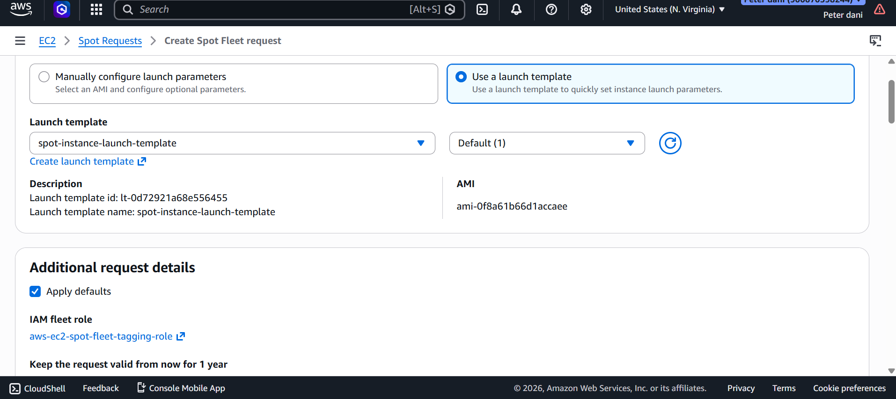
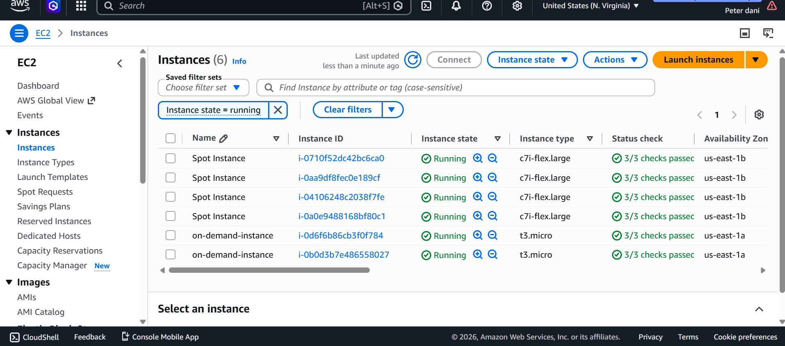
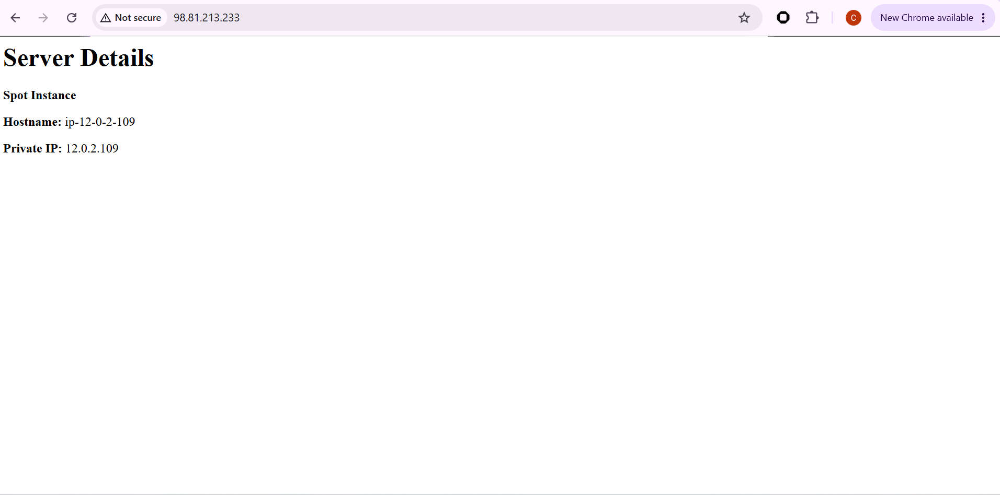
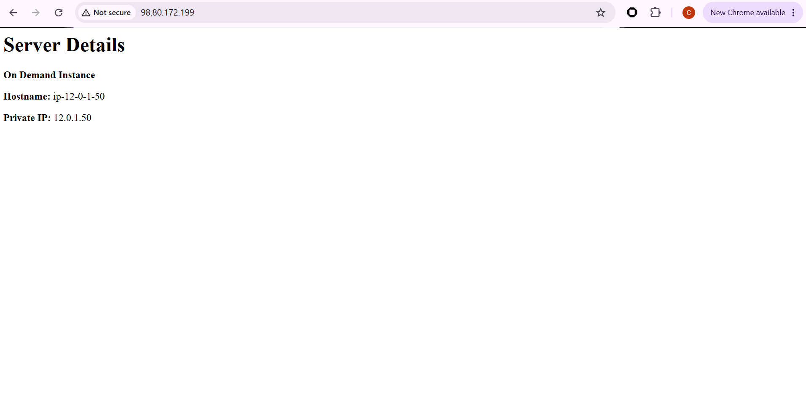
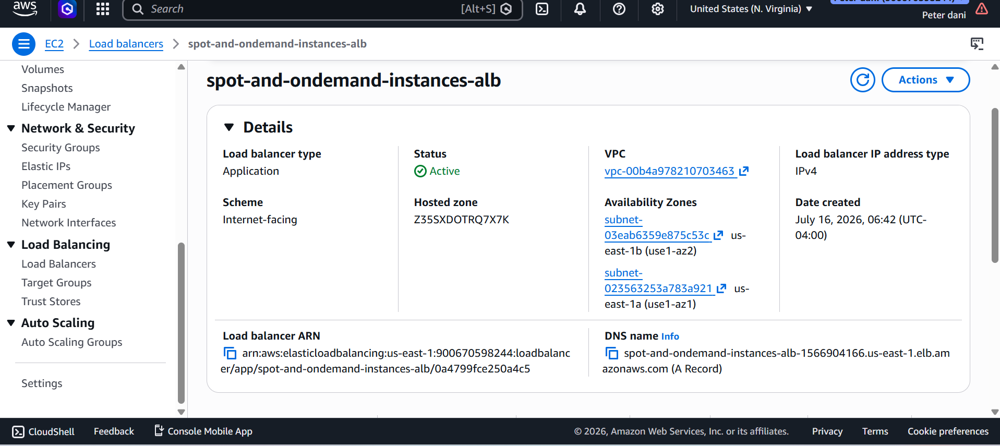
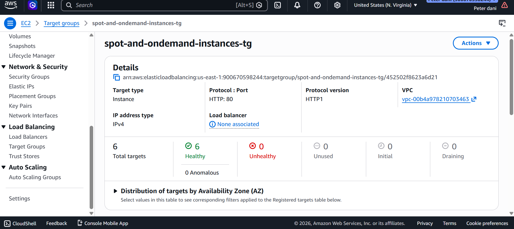
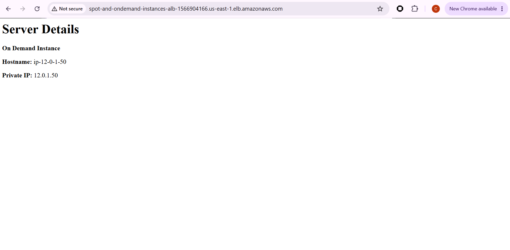

# AWS Application Load Balancer with Spot & On-Demand EC2 Instances

## Project Overview

This project demonstrates how AWS Application Load Balancers distribute incoming traffic across both Spot and On-Demand EC2 instances.

Each EC2 instance is launched using a Launch Template with a User Data script that automatically:

- Updates the server
- Installs Apache Web Server
- Creates a custom web page
- Displays:
  - Instance purchasing option (Spot or On-Demand)
  - Hostname
  - Private IP Address

Accessing the Application Load Balancer DNS and refreshing the browser routes traffic between healthy instances registered in the Target Group.

---

## Architecture

                 Internet
                     │
                     ▼
       Application Load Balancer
                     │
      ┌──────────────┴──────────────┐
      │                             │
      ▼                             ▼
 Spot EC2 Instance          On-Demand EC2 Instance
      │                             │
      └──────────────┬──────────────┘
                     ▼
              Target Group

---

## AWS Services Used

- Amazon EC2
- Spot Instances
- On-Demand Instances
- Launch Templates
- EC2 User Data
- Application Load Balancer (ALB)
- Target Groups
- Security Groups
- Amazon VPC

---

## Features

- Launch EC2 instances using Launch Templates
- Deploy both Spot and On-Demand instances
- Automatically install Apache using User Data
- Display instance information on the web page
- Register instances with a Target Group
- Route traffic through an Application Load Balancer
- Demonstrate load balancing by refreshing the ALB DNS

---

## Project Screenshots

### 1. Spot Instance Launch Request

Shows the Spot Instance request using a Launch Template.

---

### 2. Running EC2 Instances

Shows multiple Spot and On-Demand EC2 instances running.

---

### 3. Spot Instance Web Page

Displays:

- Spot Instance
- Hostname
- Private IP Address

---

### 4. On-Demand Instance Web Page

Displays:

- On-Demand Instance
- Hostname
- Private IP Address

---

### 5. Application Load Balancer

Application Load Balancer configured to distribute incoming HTTP requests.

---

### 6. Target Group

All registered EC2 instances are healthy and available to receive traffic.

---

### 7. Load Balancer DNS (On-Demand Response)

The Application Load Balancer routes the request to an On-Demand EC2 instance.

---

### 8. Load Balancer DNS (Spot Instance Response)

Refreshing the same Load Balancer DNS routes the request to a Spot EC2 instance, demonstrating load balancing across healthy targets.

---

## User Data Script

bash
#!/bin/bash

apt update -y
apt install apache2 -y

echo "<h1>Server Details</h1>

<strong>Spot Instance</strong>

<strong>Hostname:</strong> $(hostname)

<strong>Private IP:</strong> $(hostname -I | awk '{print $1}')
" > /var/www/html/index.html

systemctl restart apache2
systemctl enable apache2

The same script was modified for the On-Demand instances by replacing *Spot Instance* with *On-Demand Instance*.

---

## Learning Outcomes

Through this project I learned how to:

- Create Launch Templates
- Launch Spot and On-Demand EC2 instances
- Configure Apache using EC2 User Data
- Build an Application Load Balancer
- Create and configure Target Groups
- Register multiple EC2 instances
- Verify healthy targets
- Observe traffic distribution through the ALB

---

## Future Improvements

- Configure an Auto Scaling Group
- Add HTTPS using AWS Certificate Manager (ACM)
- Register a custom Route 53 domain
- Deploy a real web application instead of a static page
- Add CloudWatch monitoring and alarms

---

## Author

*Peter Chidubem Ozuo*

Cloud & DevOps Engineer | AWS Cloud Practitioner

Currently building hands-on AWS projects focused on cloud infrastructure, networking, automation, and high availability.
